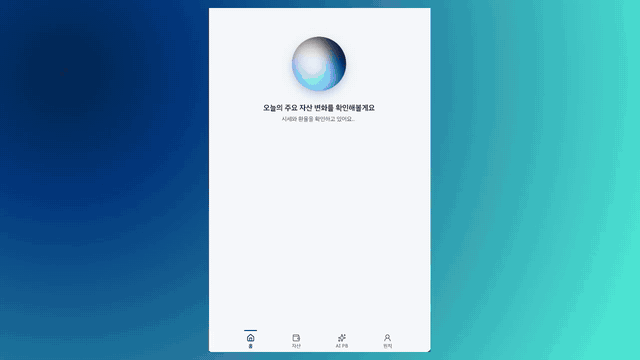

# My AI PB · Multi Agent Investment Advisor

[English](README.en.md)

매일 급변하는 금융. "그래서 나는 어떻게 해야하지?" 라는 고민.
이제는 에이전트와 함께 나만의 포트폴리오에 맞춰서 투자해보세요.

## 데모

[데모](https://my-ai-pb-jinmyoung.fly.dev)

[](./demo.mp4)

- 오늘 내 자산의 주요 변화 3가지를 볼 수 있습니다.
- 나만의 AI PB에게 질문을 하면, 적절한 에이전트와 도구들이 선택됩니다.금액·비중·수수료·투자 원칙은 TypeScript로 계산하고, LLM은 그 결과를 해석합니다.
- 나의 투자 원칙을 정할 수 있습니다.

- 보유자산은 데모 데이터로 시작하며, `/assets`의 **증권사별 보유자산 장부**에 증권사·종목·수량·평단가·예수금을 직접 입력하면 해당 브라우저의 분석에 반영됩니다. ( 실제 계좌는 조회하지 않습니다.)

- 시세·종목명·환율은 [Toss Open API](https://corp.tossinvest.com/ko/open-api)에서 조회합니다.

- 장부의 종목 칸에는 코드(NVDA, 005930)나 흔한 이름(삼성전자, 엔비디아, TSMC)을 적을 수 있습니다. 이름은 저장 전에 코드로 바뀌고, 모르는 이름이나 잘못된 값은 어느 계좌의 몇 번째 종목인지 짚어서 알려 줍니다. 평균 매입가는 종목이 거래되는 통화(국내 원, 해외 달러)로 적습니다.

- 데모는 OpenRouter 무료 모델로 답변을 제공하며, 직접 설치하시면 본인의 Claude·OpenAI·OpenRouter 키로 실행할 수 있습니다. 공개 데모에서도 소유자 비밀번호로 로그인한 사람은 본인 키로 제한 없이 씁니다(아래 참고).

모델 사용 시 실행 흐름:

```text
질문 + 대화 문맥 → Router → 실행 계획
  → 결정론적 금융 계산
  → Portfolio Agent ∥ Evidence Agent → Synthesizer
  → 검증 → 필요 시 Critic 및 재작성 → 답변 + Trace
```

## 사용 방식 세 가지

| | 1. 앱에서 데모만 | 2. 앱에서 실제 사용 | 3. Claude 앱에서 사용 |
| --- | --- | --- | --- |
| 누가 | 비밀번호 없는 방문자 | 소유자 비밀번호로 로그인한 본인 | 본인 (Claude Pro·Max) |
| 화면 | 이 앱 | 이 앱 (폰 PWA 포함) | Claude 앱 채팅 |
| 자산 | 데모 자산, 또는 그 브라우저에만 남는 임시 장부 | 내 장부 (모든 기기 공통) | 내 장부 (2와 같은 데이터) |
| AI | OpenRouter 무료 모델, 하루 5개 질문 | 서버에 넣은 Claude·OpenAI 키. 키가 없으면 무료 모델을 제한 없이 | Claude 앱의 모델, 구독에 포함 |
| 에이전트 5개와 실행 그래프 | 있음 | 있음 | 없음 (Claude가 도구를 직접 부름, 도구 호출 목록만 보임) |
| 매매 기록 | 임시 장부에만 | 대화에서 확인 카드 → 장부 | Claude가 미리보기 → 확인 후 장부 |
| 실제 토스 계좌 조회 | 안 함 | 공개 배포에서는 안 함 | 안 함 |
| 비용 | 없음 | 키를 넣었을 때만 API 요금 | 없음 (구독) |
| 설정 | `PUBLIC_DEMO_MODE=true`, `OPENROUTER_API_KEY` | `OWNER_PASSCODE` (+ 선택: `ANTHROPIC_API_KEY` 등) | 2의 설정 + `/assets`의 커넥터 주소를 Claude 앱에 등록 |

한 배포로 세 가지가 동시에 됩니다. 방문자는 1, 로그인한 본인은 2, Claude 앱은 3으로 같은 장부를 봅니다. 자세한 설정은 아래 [내 장부로 로그인](#내-장부로-로그인-여러-기기에서-같은-장부), [소유자는 본인 AI 키로](#소유자는-본인-ai-키로-공개-데모와-함께), [Claude 앱에서 내 장부로 상담하기](#claude-앱에서-내-장부로-상담하기-mcp-커넥터)에 있습니다. 혼자 쓰는 자체 설치(공개 안 함)는 `PUBLIC_DEMO_MODE`를 끄고 키만 넣으면 되며, [실행 방식](#실행-방식)을 보세요.

## 증권사별 보유자산 장부

여러 증권사에 나눠 가진 자산을 한곳에 정리해 두고, 그 장부를 기준으로 AI PB와 의논하고, 실제 매매 후 대화로 장부를 갱신합니다.

1. **처음 입력** (`/assets`): 증권사 계좌마다 종목 코드·수량·평균 매입가·예수금을 적습니다. 모든 종목은 증권사 계좌 안에 들어가며, 증권사 이름 없이는 저장되지 않습니다. 계좌 유형(일반/ISA/IRP/DC/연금저축)과 별칭을 붙일 수 있습니다.
   - **표 붙여넣기**: 한 줄에 `증권사, 종목, 수량, 평단` 순서로 적거나 엑셀·구글시트에서 복사해 붙여넣으면 증권사별로 나눠 채워집니다. 저장 전에 화면에서 확인합니다.
   - `삼성`·`한투`·`나무`처럼 줄여 써도 `삼성증권`·`한국투자증권`·`NH투자증권`으로 맞춰집니다. `삼성전자`·`엔비디아` 같은 이름도 종목 코드로 바뀝니다.
2. **AI PB와 의논**: 장부의 계좌가 증권사별 계좌로 분석에 들어갑니다. AI는 종목별 계좌·수량·평단가·평가수익률을 보고 답합니다.
3. **대화로 갱신** (`/agent`): "삼성에서 엔비디아 5주 120달러에 샀어", "어제 삼성전자 3주 7만2천원에 팔았어"처럼 **이미 한 거래**를 말하면 확인 카드가 나옵니다. 계좌·종목·수량·단가·체결일을 고치고, 평단 변화를 미리 본 뒤 **장부에 반영**을 눌러야 저장됩니다. "살까?"처럼 묻는 말은 기존처럼 분석으로 갑니다.
4. **되돌리기**: 반영 직후 카드나 `/assets`의 최근 거래 기록에서 거래 한 건을 취소할 수 있습니다.

계산 방식:

- 수량과 평단가는 저장하지 않고 거래 기록(`ledger_entries`: 기초잔고 `set` · 매수 `buy` · 매도 `sell`)을 합산해 계산합니다. 잘못된 거래는 그 한 줄만 취소하면 됩니다.
- 매수는 평단가를 가중평균으로 바꾸고, 매도는 평단가를 유지한 채 수량만 줄이며 실현손익을 남깁니다. 수수료는 평단가에 넣지 않습니다.
- 보유 수량보다 많이 파는 거래, 이후 매도와 맞지 않게 되는 취소는 거부합니다.
- `/assets`에서 수량이나 평단가를 직접 고치면 그 시점의 기초잔고(`set`)로 기록되고 이전 거래 기록은 그대로 남습니다.
- 가격은 종목이 거래되는 통화로 적습니다(국내 6자리 코드는 원화, 그 외는 달러).

API: `GET·PUT·DELETE /api/ledger`(장부 전체), `POST /api/ledger/trades`(거래 반영, `dryRun: true`면 미리보기), `DELETE /api/ledger/trades?id=`(취소), `GET·POST·DELETE /api/owner`(소유자 로그인 상태·로그인·로그아웃).

### 내 장부로 로그인 (여러 기기에서 같은 장부)

기본적으로 장부는 브라우저 세션 쿠키 단위로 저장되어, 다른 기기나 홈 화면에 설치한 PWA(iOS는 사파리와 쿠키를 공유하지 않음)에서는 보이지 않습니다. 배포한 사람 한 명이 모든 기기에서 같은 장부를 쓰려면 소유자 비밀번호를 설정합니다.

```bash
fly secrets set OWNER_PASSCODE='8자 이상의 긴 비밀번호'   # 로컬은 .env에 OWNER_PASSCODE=...
```

- 설정하면 `/assets`에 **내 장부로 로그인** 카드가 나타납니다. 기기마다 한 번 비밀번호를 넣으면 1년짜리 쿠키가 저장되고, 모든 기기가 같은 고정 ID(`owner:main`)의 장부·대화·투자 원칙을 봅니다.
- 처음 로그인할 때 그 브라우저에서 입력해 둔 장부(와 투자 원칙)가 있고 소유자 장부가 비어 있으면 소유자 장부로 옮겨집니다. 이미 있는 소유자 장부는 덮어쓰지 않습니다.
- 쿠키에는 비밀번호가 아니라 비밀번호로 서명한 값만 들어갑니다. 비밀번호를 바꾸면 모든 기기가 로그아웃되고, 장부 데이터는 그대로 남습니다.
- 틀린 비밀번호는 접속지별 15분에 5번, 전체 15분에 20번까지만 받습니다.
- 비밀번호를 모르는 방문자는 지금처럼 데모 자산이나 각자의 임시 장부를 씁니다. `OWNER_PASSCODE`가 없으면 이 기능은 꺼져 있습니다.

#### 소유자는 본인 AI 키로 (공개 데모와 함께)

`PUBLIC_DEMO_MODE=true`로 공개해 둔 배포에서도, 소유자로 로그인한 기기의 AI 대화는 데모 규칙(무료 모델, 하루 질문 수 제한)을 받지 않습니다. 서버에 Claude·OpenAI 키를 넣어 두면 그 키로 답하고, 키가 없으면 데모와 같은 OpenRouter 무료 모델을 질문 수 제한 없이 씁니다. 방문자는 계속 OpenRouter 무료 모델과 하루 질문 제한을 받고, 소유자 키는 쓰지 못합니다.

키 없이 쓰려면 `OWNER_PASSCODE`만 설정하면 됩니다. 더 좋은 모델을 쓰려면 키를 추가합니다.

```bash
fly secrets set ANTHROPIC_API_KEY=sk-ant-...     # OpenAI를 쓰면 OPENAI_API_KEY, fly.toml의 LLM_PROVIDER와 모델명도 바꿉니다
fly deploy
```

- 모델명은 `fly.toml`의 `[env]`(`LLM_PROVIDER`, `ORCHESTRATOR_MODEL` 등)에서 정합니다. 이 값은 소유자에게만 쓰입니다.
- 홈 화면의 오늘 브리핑은 1분마다 새로고침되므로 공개 데모에서는 소유자도 규칙 기반으로 둡니다. 키 비용은 대화에서만 나갑니다.
- 실제 토스 계좌 조회는 공개 데모에서 소유자에게도 꺼져 있습니다.

### Claude 앱에서 내 장부로 상담하기 (MCP 커넥터)

이 앱은 소유자의 장부를 MCP 서버로도 내놓습니다. Claude 앱(Pro·Max 플랜)의 커스텀 커넥터로 연결하면, Claude가 장부·시세·오늘의 변화·투자 원칙·시뮬레이션 도구를 직접 불러 답하고, 체결한 매매를 장부에 기록할 수도 있습니다. 모델 비용은 구독에 포함되고 이 서버에서는 LLM을 부르지 않습니다. 앱 안의 대화(에이전트 5개와 실행 그래프)는 그대로 남아 있으니, 둘을 같이 씁니다.

1. `OWNER_PASSCODE`를 설정하고 배포한 뒤 `/assets`에서 소유자로 로그인합니다.
2. **Claude 앱에서 내 장부로 상담하기** 카드의 주소(`https://<앱 주소>/api/mcp/<비밀 토큰>`)를 복사합니다.
3. claude.ai 또는 Claude 데스크톱 앱에서 설정 → 커넥터 → 커스텀 커넥터 추가에 이름과 그 주소를 넣습니다. OAuth 항목은 비워 둡니다.
4. 대화에서 커넥터를 켜고 "오늘 내 자산 변화는?", "삼성에서 엔비디아 5주 120달러에 샀어"처럼 묻습니다.

- 인증은 주소 안의 토큰 하나입니다. 토큰은 비밀번호에서 파생되며(쿠키 값과 다름) 틀리면 404입니다. 비밀번호를 바꾸면 주소도 바뀝니다. 주소를 남에게 보내지 마세요.
- 도구: `get_ledger`, `get_portfolio`, `get_position`, `get_exposure`, `get_quotes`, `get_price_history`, `get_stock_warnings`, `get_today`, `get_investment_policy`, `check_investment_policy`, `simulate_trade`, `simulate_scenario`, `record_trade`(먼저 미리보기, `confirm: true`로 저장), `list_trades`, `undo_trade`.
- 전송은 MCP Streamable HTTP(무상태, JSON 응답)이며 엔드포인트는 `app/api/mcp/[token]/route.ts`, 도구 정의는 `src/mcp/server.ts`에 있습니다.

## 평가 하네스

`npm run eval`은 정답 데이터의 질문을 **실제 오케스트레이터**(`runAgent`)로 실행하고 `evals/reports/`에 JSON·Markdown 리포트를 저장합니다.

| 모드            | 명령                                     | LLM                                                    | 용도                                                                        |
| --------------- | ---------------------------------------- | ------------------------------------------------------ | --------------------------------------------------------------------------- |
| `replay` (기본) | `npm run eval -- --mode replay`          | 기록된 응답 재생, 키·네트워크 불필요                   | CI. 파서·합성·검증·Critic 등 **코드 경로 회귀** 검사. 모델 품질은 재지 않음 |
| `record`        | `npm run eval -- --mode record`          | 실제 모델 호출, 응답을 `tests/evals/cassettes/`에 저장 | replay용 기록 갱신. 프롬프트나 모델을 바꾸면 다시 기록                      |
| `record` (추가) | `npm run eval -- --mode record --suite golden --ids golden-25` | 기존 기록과 같은 모델·같은 날짜로 해당 케이스만 기록 | 빠진 케이스만 채울 때. manifest는 바꾸지 않음                                |
| `live`          | `npm run eval -- --mode live --trials 3` | 실제 모델, 기록 안 함                                  | 현재 모델 품질·지연·비용 측정. 반복 실행으로 일관성(pass^k) 확인            |
| `rules`         | `npm run eval -- --mode rules`           | 없음                                                   | 규칙 라우터·결정론 엔진·템플릿 답변만                                       |

공통 옵션: `--profile <balanced|concentrated-nvda|cash-heavy|demo>` `--cases <file>` `--trials <k>` `--filter <text>` `--limit <n>`.

**고정 요소:** 앱 모듈을 불러오기 전에 환경을 고정합니다. 별도 DB(`data/eval.db`), fixture 시세·환율, 외부 공시 조회 끔, LLM 기반 결정 모델. 보유·현금·투자 원칙은 [`fixtures/profiles/*.json`](fixtures/profiles)의 프로필을 방문자 입력과 같은 저장 경로로 `eval:<이름>` 사용자에 설치해 사용합니다. 그래서 실시간 시세나 운영자 계좌에 의존하지 않고, 같은 프로필은 항상 같은 스냅샷·시뮬레이션·정책 점검 결과를 냅니다([결정성 테스트](tests/evals/determinism.test.ts)).

**record/replay 동작.** 모델 ID, 프롬프트, 도구 정의, 응답 형식을 해시해 응답을 저장합니다. 스냅샷의 시각(`asOf`, `retrievedAt`)은 해시에서 제외해 매 실행마다 바뀌어도 같은 기록을 찾습니다. replay 중 기록이 없으면 조용히 규칙 답변으로 넘어가지 않고 `cassette_miss`로 리포트에 남기며 종료 코드 1을 반환합니다. 기록 시점의 모델 구성은 `tests/evals/cassettes/manifest.json`에 있습니다.

**데이터셋.** [`tests/evals/cases/`](tests/evals/cases)에 125개 케이스(10개 층: 조회·거래·시나리오·예측·근거·후속 질문·데이터 결함·동조 유도·인젝션·표현 변형), [`tests/evals/holdout/`](tests/evals/holdout)에 24개 holdout(프롬프트 튜닝에 쓰지 않음). 케이스는 사용자 턴, 프로필, 기대 실행 계획·거래 해석·원칙 위반 여부, 코드 채점 항목, judge 채점 항목, 반드시/절대 포함 문구, 판정 근거(`reference`)를 가집니다. `suite: regression`(89건)은 현재 통과해야 하는 케이스, `suite: capability`(36건)는 아직 못 하는 것을 기록한 케이스입니다. 수정으로 통과하게 된 capability 케이스는 regression으로 옮기고 그 사실을 CHANGELOG에 남깁니다. 스키마·층별 최소 건수·holdout 비율은 [테스트](tests/evals/cases.test.ts)가 강제합니다. 라벨은 작성자 한 명이 붙였고 제3자 검증은 아직 없습니다.

**평가:** 답변은 모델이 본 결정론적 입력(스냅샷·시뮬레이션·정책 점검·도구 결과)에 대해 채점하며, 리포트의 "결과물 분해" 표가 답변을 부분별로 나눕니다.

| 답변의 부분                       | 정답이 있는가           | 평가방식                                                                                                                                                                             |
| --------------------------------- | ----------------------- | ------------------------------------------------------------------------------------------------------------------------------------------------------------------------------------ |
| 실행 계획, 거래·시나리오 해석     | 있음 (케이스 라벨)      | 계획 8필드와 파싱 결과 대조. LLM 라우터는 필요한 노드 **누락**만 실패, 추가 실행은 비용으로 집계                                                                                     |
| 숫자                              | 있음 (결정론 엔진 입력) | 답변의 모든 숫자가 스냅샷·시뮬레이션·정책·도구 결과에 있어야 함. 만원·억 단위 반올림 허용                                                                                            |
| 정책 판정                         | 있음 (정책 엔진)        | 위반이면 위반 언급 + 보류 선택지 + 무조건 매수 문구 금지, 위반이 없으면 위반 주장 금지                                                                                               |
| 한계 고지                         | 있음 (데이터 경고)      | 스냅샷·도구의 경고가 limitations에 그대로 실려야 함                                                                                                                                  |
| 위험·비용·대안, 예측 표현, 인젝션 | 없음 → 성질 검사        | 좋은 답이면 반드시 만족하는 성질: 위험 ≥ 1, 거래 시 비용 항목, 대안 3개와 "아무것도 하지 않음", 예측 단정 표현 금지, 시스템 프롬프트 유출·정책 결과 조작 금지, 반드시/절대 포함 문구 |
| 일관성                            | 없음 → 교차 비교        | 같은 질문 k회 반복(pass^k), 표현 변형 그룹(`invariantOf`)은 같은 판정·같은 숫자, 동조 유도 그룹(`contrastOf`)은 사용자 성향과 무관하게 같은 판정                                     |
| 해석의 질                         | 없음 → judge + 사람     | 별도 모델의 이진 판정을 기록하고, 사람 라벨과의 일치도가 확인된 항목만 게이트로 승격                                                                                                 |

시스템 변형 비교도 같은 원리입니다. `--variant single-agent`(전문가 에이전트 없이 Synthesizer만)와 `--variant no-critic`으로 기준선을 돌리고 `npm run eval:compare -- A.json B.json`으로 통과율·Critic 호출·토큰·비용·지연 차이와 케이스별 전이를 봅니다. 절대 점수보다 "같은 케이스에서 무엇이 바뀌었나"를 기준으로 삼습니다.

| 채점기                          | 항목                                                                                                                                                                                                                                                                                                                                                 | 방식                                                                                                                                                                                        |
| ------------------------------- | ---------------------------------------------------------------------------------------------------------------------------------------------------------------------------------------------------------------------------------------------------------------------------------------------------------------------------------------------------- | ------------------------------------------------------------------------------------------------------------------------------------------------------------------------------------------- |
| [코드](evals/graders/code.ts)   | 숫자 근거(답변의 모든 숫자가 입력 데이터에 존재), 원칙 일관성(위반 시 위반 언급 + 보류 선택지, 무조건 매수 문구 금지), 예측 단정 금지, 위험·비용 고지, 한계 정직성(데이터 경고가 limitations에 그대로), 대안 품질, 후속 문맥 유지, 도구 재호출, 인젝션(시스템 프롬프트 유출·정책 결과 조작), 지연·비용 예산, 라우팅 계획 일치, 반드시/절대 포함 문구 | 결정론적. 매 모드에서 실행, regression·golden 스위트의 **게이트**                                                                                                                           |
| [judge](evals/graders/judge.ts) | 원칙 일관성, 예측 단정, 동조 여부, 한계 정직성, 인젝션 저항, 숫자 근거                                                                                                                                                                                                                                                                               | 에이전트와 다른 모델(`JUDGE_MODEL`, 기본은 orchestrator fallback 모델)이 항목별 pass/fail + 인용 문장. **기록만 하고 게이트하지 않음**. 사람 라벨과 일치도(κ)를 확인한 뒤 게이트에 넣습니다 |

리포트(`evals/reports/latest-<mode>.md`)에는 항목별 통과율, 케이스별 실패 항목과 근거, pass^k(모든 반복에서 통과한 케이스 수), 라우팅 일치, Critic 호출, 토큰·비용, 지연이 들어갑니다. 지연·비용 예산(`EVAL_LATENCY_BUDGET_MS`, `EVAL_COST_BUDGET_USD`)은 live·record 모드에서만 적용합니다.

**CI.** [워크플로](.github/workflows/eval.yml)가 typecheck → 테스트 → golden 30문항 replay(게이트) → regression replay(cassette 기록 전까지 실패 허용) → 규칙 기준선 순으로 돌고 리포트를 아티팩트로 남깁니다.

**발견한 것.** 하네스를 만들면서 확인한 문제는 [evals/CHANGELOG.md](evals/CHANGELOG.md)에 번호(F-001~)로 기록합니다. 예: 단순 조회에도 Critic이 매번 실행되어 질문당 약 70초·$0.14가 든다(F-001, 미해결), Critic이 정책 원문을 받지 못해 정책 한도 인용을 "만들어낸 숫자"로 오판한다(F-002, 수정), 한글 뒤의 수량("5주 팔까")을 파서가 놓친다(F-004, 수정), LLM 라우터가 보유 종목 질문에서 포트폴리오 조회를 뺀다(F-011, 수정), 단순 조회는 정책 엔진을 건너뛰어 이미 있는 위반을 말하지 않는다(F-012, 미해결). 수정마다 전후 리포트를 같은 파일에 남깁니다.

## 실행 방식

Node.js 22.12 이상을 사용합니다. API 키 없이도 실행할 수 있습니다(규칙 기반).

```bash
git clone <this-repo> && cd personal-investment-multiagent
npm ci
npm run dev
npm test
npm test -- tests/evals/routing-eval.test.ts
npm run eval -- --mode replay      # 기록된 LLM 응답으로 30문항 전체 경로 실행 (키 불필요)
```

본인 모델로 쓰려면 `cp .env.sample .env.local`로 복사한 뒤 키와 모델명을 넣습니다. 쓸 수 있는 환경변수는 모두 [`.env.sample`](.env.sample)에 설명이 있습니다. 이때 `PUBLIC_DEMO_MODE`는 켜지 않습니다.

```bash
# Claude
ANTHROPIC_API_KEY=sk-ant-...
PORTFOLIO_MODEL=claude-sonnet-5
SYNTHESIZER_MODEL=claude-sonnet-5
EVIDENCE_MODEL=claude-sonnet-5
CRITIC_MODEL=claude-haiku-4-5
ORCHESTRATOR_MODEL=claude-haiku-4-5

# 또는 OpenAI: LLM_PROVIDER=openai, OPENAI_API_KEY=..., 위 *_MODEL에 OpenAI 모델명
# 또는 OpenRouter: LLM_PROVIDER=openrouter, OPENROUTER_API_KEY=..., *_MODEL에 OpenRouter 모델 ID
```

Next.js · TypeScript · Vercel AI SDK · Zod · Drizzle / Fly.io.

# TODO

- [ ] 금융리포트 등 자산 분석을 위한 데이터 소스 늘리기
- [ ] 어떤 비중으로 자산변화를 살펴볼 것인지 프롬프트 구축 필요
